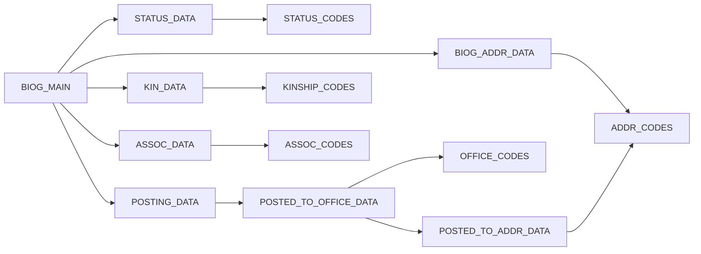

# CBDB 数据化首版说明

本文档配套 `output_cbdb_v1/` 下的 CSV 数据集，说明如何把 CBDB 原始关系型数据库整理成可用于历史人物分析的结构化数据。

## 1. 数据库整体结构说明（ER 思路）

- **人物主表**：`BIOG_MAIN` 以 `c_personid` 为核心，保存姓名、性别、索引年、生卒年、活动年与索引地。
- **身份维度**：`STATUS_DATA` + `STATUS_CODES`，描述人物在社会身份/职业上的多条记录。
- **地址经历**：`BIOG_ADDR_DATA` + `ADDR_CODES` + `BIOG_ADDR_CODES`，描述人物相关地点与类型。
- **任官驻地**：`POSTING_DATA` → `POSTED_TO_OFFICE_DATA` → `OFFICE_CODES`，再可选挂接 `POSTED_TO_ADDR_DATA` → `ADDR_CODES`。
- **亲属与社会关系**：`KIN_DATA` + `KINSHIP_CODES`、`ASSOC_DATA` + `ASSOC_CODES`。



## 2. 关键字段含义表

| 表 | 字段 | 含义 | 来源/说明 |
|---|---|---|---|
| `BIOG_MAIN` | `c_personid` | 人物主键 | 可溯源唯一ID |
| `BIOG_MAIN` | `c_name_chn` | 中文姓名 | 自动拼接字段 |
| `BIOG_MAIN` | `c_dy` | 朝代编码 | 缺失保留NULL |
| `BIOG_MAIN` | `c_index_addr_id` | 索引地ID | 0视为未知地 |
| `STATUS_DATA` | `c_status_code` | 身份编码 | 原始编码 |
| `BIOG_ADDR_DATA` | `c_addr_type` | 地址类型编码 | 原始编码 |
| `POSTED_TO_OFFICE_DATA` | `c_appt_code` | 任官方式编码 | 原始编码 |
| `POSTED_TO_OFFICE_DATA` | `c_office_id` | 职官编码 | 原始编码 |
| `KIN_DATA` | `c_kin_code` | 亲属关系编码 | 原始编码 |
| `ASSOC_DATA` | `c_assoc_code` | 社会关系编码 | 原始编码 |

完整字段字典见 `data_dictionary.csv`。

## 3. 数据口径与处理规则

- 未知值（`0`、`未詳`、空值）保留为空串或 `NULL`，不默认推断。
- 时间字段不做插值，缺失保留 `NULL`。
- 地址与任官驻地仅在源表可定位坐标时才生成坐标字段，不影响主维度完整性。
- 为便于 Excel/Pandas 读取，所有 CSV 使用 `UTF-8 with BOM`。

## 4. 案例链路：人物如何“数据化”

### 案例 1：`c_personid=1`（安惇）

原始数据链路：

- `BIOG_MAIN`：主维度 → `dim_person.csv`。
- `STATUS_DATA + STATUS_CODES`：身份记录 → `fact_person_status.csv`。
- `POSTING_DATA → POSTED_TO_OFFICE_DATA → OFFICE_CODES (+ ADDR_CODES)`：任官地点 → `fact_person_posting.csv`。
- `KIN_DATA + KINSHIP_CODES`：亲属关系 → `fact_person_kin.csv`。
- `ASSOC_DATA + ASSOC_CODES`：社会关系 → `fact_person_assoc.csv`。

结果样例（带坐标的可制图记录）：

**身份记录**

| c_personid | c_status_desc_chn | c_firstyear | c_lastyear |
|---|---|---|---|
| 1 | [財政官員] | 0 | 0 |
| 1 | [宰執] | 0 | 0 |

**任官与驻地（含坐标）**

| c_personid | c_office_chn | posting_addr_chn | x_coord | y_coord |
|---|---|---|---|---|
| 1 | 教授 | 成都 | 104.077995 | 30.650385 |
| 1 | 轉運司判官 | 夔州 | 109.52513123 | 31.054750443 |

### 案例 2：`c_personid=4`（查道）

**任官与驻地（含坐标）**

| c_personid | c_office_chn | posting_addr_chn | x_coord | y_coord |
|---|---|---|---|---|
| 4 | 縣尉 | 館陶 | 115.318095 | 36.525088 |
| 4 | 知某州軍州事 | 果州 | 106.105835 | 30.819111 |
| 4 | 知某州軍州事 | 虢州 | 110.865379 | 34.527512 |
| 4 | 知某州軍州事 | 遂州 | 105.5702 | 30.50392 |
| 4 | 知某州軍州事 | 襄州 | 112.15869904 | 32.026519775 |
| 4 | 知某州軍州事 | 襄陽府 | 112.158699 | 32.026524 |
| 4 | 轉運副使 | 京西路 | 112.38263 | 34.66528 |
| 4 | 觀察推官 | 興元府 | 107.03518677 | 33.07648468 |
| 4 | 通判某州軍州事 | 遂州 | 105.5702 | 30.50392 |

## 5. 产出文件说明

- `dim_person.csv`：人物主维度。
- `dim_address.csv`：地址主维度（含坐标）。
- `fact_person_status.csv`：人物-身份维度。
- `fact_person_address.csv`：人物-地址维度。
- `fact_person_posting.csv`：人物-任官-驻地维度。
- `fact_person_kin.csv`：亲属关系边表。
- `fact_person_assoc.csv`：社会关系边表。
- `data_dictionary.csv`：字段字典。
- `validation_summary.json`：源表与输出计数。
- `verify_report.json`：唯一性与覆盖度校验。

## 6. 校验摘要

```json
{
  "source_db": "D:\\虚拟C盘\\study\\人工智能与计算思维大作业\\latest\\cbdb_20260606.sqlite3",
  "tables": {
    "BIOG_MAIN": 658941,
    "STATUS_DATA": 71718,
    "BIOG_ADDR_DATA": 458271,
    "POSTED_TO_OFFICE_DATA": 588646,
    "KIN_DATA": 557601,
    "ASSOC_DATA": 188777
  },
  "outputs": {
    "dim_person": 659183,
    "dim_person_coord": 381554,
    "fact_person_status": 71745,
    "fact_person_address": 458403,
    "fact_person_posting": 589875,
    "fact_person_kin": 557907,
    "fact_person_assoc": 189297,
    "dim_address": 30100
  },
  "case_samples": {
    "case_person_ids": [
      1,
      4
    ],
    "status_sample_count": 5,
    "posting_sample_count": 35
  }
}
```

```json
{
  "row_counts": {
    "dim_person": 659183,
    "dim_address": 30100,
    "fact_person_status": 71745,
    "fact_person_address": 458403,
    "fact_person_posting": 589875,
    "fact_person_kin": 557907,
    "fact_person_assoc": 189297
  },
  "primary_key_duplicates": {
    "dim_person(c_personid)": 0,
    "fact_person_status(c_personid,c_sequence,c_status_code)": 0,
    "fact_person_address(c_personid,c_addr_id,c_addr_type,c_sequence)": 0,
    "fact_person_kin(c_personid,c_kin_id,c_kin_code)": 0
  },
  "person_coverage": {
    "status_persons": 55393,
    "address_persons": 393390,
    "posting_persons": 298398,
    "kin_persons": 284278,
    "assoc_persons": 44353
  },
  "dim_person_fix": {
    "fixed": false,
    "duplicate_rows": 0
  }
}
```
